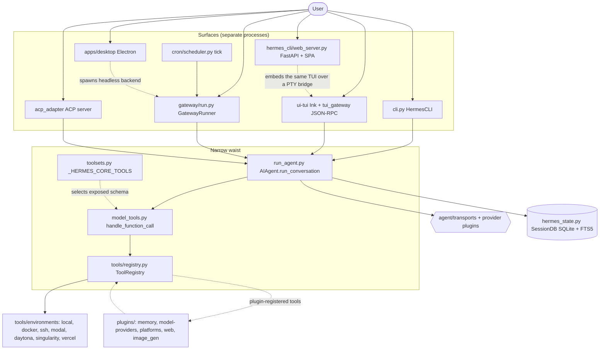
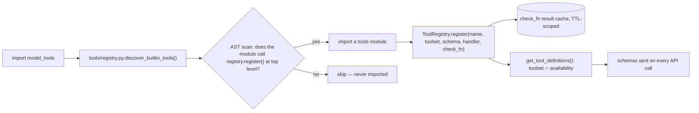

# Architecture

Hermes is one agent engine wearing six faces. `AIAgent` in
[`run_agent.py`](../../run_agent.py) owns the conversation loop, and every surface —
the classic CLI, the Ink TUI, the messaging gateway, the dashboard, the desktop
app, the ACP editor adapter, the cron scheduler, the batch runner — constructs an
`AIAgent` and drives it through `run_conversation()`. Verified construction sites
include `cli.py`, `gateway/run.py`, `gateway/stream_consumer.py`,
`gateway/platforms/api_server.py`, `tui_gateway/server.py`, `cron/scheduler.py`,
`acp_adapter/session.py`, `batch_runner.py`, `tools/delegate_tool.py`, and
`agent/curator.py`. Because the loop is shared, a capability added once works on
every surface; because the surfaces are separate processes, they can be deployed
apart.

Data enters from a platform adapter or a terminal, becomes an OpenAI-shaped
message list, and is sent to a provider transport together with the session's tool
schemas. The model either answers or requests tool calls; tool calls dispatch
through `model_tools.handle_function_call()` into the `ToolRegistry`, whose
entries were populated at import time by `tools/*.py`. Results append as `tool`
messages and the loop repeats until the model stops calling tools. Everything the
loop produces is persisted to a single SQLite store (`hermes_state.py`) that all
surfaces share, which is what makes a conversation started on Telegram resumable in
the TUI.

The shape that governs all of this: **the core is a narrow waist, capability lives
at the edges.** Every model tool is serialized and sent on every API call, so the
core tool list is deliberately tiny (`_HERMES_CORE_TOOLS`, `toolsets.py:31`) and
new capability is pushed outward to CLI commands, skills, service-gated tools,
plugins, and MCP servers. The second load-bearing invariant is **per-conversation
prompt caching**: the system prompt is byte-stable for the life of a conversation,
message roles strictly alternate, and context compression is the only sanctioned
mid-conversation mutation. Anything that breaks either silently multiplies the
user's bill.

## Components

- **Agent engine** — `AIAgent`, the tool-calling loop, iteration budget, guards,
  compaction. See [`modules/agent-core.md`](modules/agent-core.md).
- **Tool system** — `ToolRegistry`, auto-discovery, toolsets, dispatch, terminal
  backends. See [`modules/tools.md`](modules/tools.md).
- **Provider layer** — `ProviderProfile` plugins + transports that absorb API
  dialect differences. See
  [`modules/providers-transports.md`](modules/providers-transports.md).
- **Gateway** — long-running process owning platform adapters, session keying,
  delivery, slash interception. See [`modules/gateway.md`](modules/gateway.md).
- **CLI surface** — `HermesCLI`, the slash-command registry, config, skins.
  See [`modules/cli.md`](modules/cli.md).
- **TUI** — Node/Ink renderer plus a Python JSON-RPC host.
  See [`modules/tui.md`](modules/tui.md).
- **Dashboard** — FastAPI server + React SPA that embeds the real TUI over a PTY
  bridge. See [`modules/web-dashboard.md`](modules/web-dashboard.md).
- **Desktop app** — Electron renderer on the same JSON-RPC backend, headless mode.
  See [`modules/desktop.md`](modules/desktop.md).
- **ACP adapter** — Agent Client Protocol server for VS Code / Zed / JetBrains.
  See [`modules/acp.md`](modules/acp.md).
- **State** — SQLite session DB with FTS5 search, profile-aware paths, logging.
  See [`modules/state-persistence.md`](modules/state-persistence.md).
- **Extension systems** — four independent plugin discovery families.
  See [`modules/plugins.md`](modules/plugins.md).
- **Learning loop** — skills, usage telemetry, the Curator.
  See [`modules/skills-curator.md`](modules/skills-curator.md).
- **Multi-agent** — `delegate_task` subagents and the durable Kanban board.
  See [`modules/delegation-kanban.md`](modules/delegation-kanban.md).
- **Scheduler** — cron store, tick loop, hardened delivery.
  See [`modules/cron.md`](modules/cron.md).

## System Diagram

The dashed edges are the interesting ones. The dashboard does not reimplement chat —
it mounts the same Ink binary through a PTY WebSocket. The desktop app does not
embed the TUI at all; it has its own composer and talks JSON-RPC to a headless
`hermes serve`. And plugins do not patch core: they register into the registry at
discovery time.

## Tool Registration Flow

Discovery is AST-gated (`_is_registry_register_call`, `_module_registers_tools` in
`tools/registry.py`) rather than blind-importing every file, so an unused tool
module costs nothing at startup. Registration alone is not enough: a tool reaches
the model only if its name appears in a toolset.

## Data Flow — one turn

1. **Ingress** — a platform adapter receives a message, or the TUI/CLI submits a
   prompt: [`gateway/run.py`](../../gateway/run.py),
   [`tui_gateway/server.py`](../../tui_gateway/server.py).
2. **Guards** — while an agent is running, the base adapter queues incoming
   messages and the runner intercepts control commands before they reach
   `interrupt()`: [`gateway/platforms/base.py`](../../gateway/platforms/base.py).
3. **Session keying** — the message maps to a session identity and history:
   [`gateway/session.py`](../../gateway/session.py).
4. **Prompt assembly** — system prompt built once and frozen; skills injected as a
   *user* message to protect the cache:
   [`agent/prompt_builder.py`](../../agent/prompt_builder.py),
   [`agent/skill_commands.py`](../../agent/skill_commands.py).
5. **Model call** — messages + tool schemas through a transport:
   [`agent/transports/base.py`](../../agent/transports/base.py).
6. **Tool dispatch** — `handle_function_call()` → registry handler, wrapped,
   error-bounded: [`model_tools.py`](../../model_tools.py),
   [`tools/registry.py`](../../tools/registry.py).
7. **Loop or stop** — budget-checked iteration until no tool calls remain:
   [`run_agent.py`](../../run_agent.py),
   [`agent/iteration_budget.py`](../../agent/iteration_budget.py).
8. **Persist** — session and messages written, FTS5-indexed:
   [`hermes_state.py`](../../hermes_state.py).
9. **Egress** — delivery with media policy and filters:
   [`gateway/delivery.py`](../../gateway/delivery.py).

Full traces with call-level detail: [diagrams/sequences.md](diagrams/sequences.md).

## Surface Capability Is Session-Scoped

The subtlest rule in the codebase, and the one most often broken by well-meaning
patches. A tool that works only because of *who is connected* — desktop panes, the
in-app browser, message reactions, Projects — must resolve availability from the
**session's own platform**, never from an env var on the backend process. The
client and the backend are separate machines on separate clocks: a desktop app may
drive a locally spawned backend, one over SSH, one behind a plain URL + token, or
Hermes Cloud. Only the first two carry `HERMES_DESKTOP=1`, so every env-keyed GUI
gate is a silent no-op on the other half — and the failure is invisible, because
the tool is stripped from the schema before the model ever sees it, on a backend
whose platform hint still tells the model it is chatting inside the desktop app.

The implemented pattern, verified in source: keep such tools off `_HERMES_CORE_TOOLS`
so nobody else pays their schema, put them in a named toolset (`desktop_ui`,
`project`), and let the GUI host fold that toolset in based on the session's
platform — `_load_enabled_toolsets(platform)` at `tui_gateway/server.py:4484`,
which resolves `session_platform = platform or _resolve_session_platform()`. The
comment block at `toolsets.py:36-42` records exactly this reasoning and names the
env-var approach as the thing it is avoiding. `check_fn` answers *reachability* or
*user opt-in*, never surface, and its results are TTL-cached process-wide — one
process serves many sessions, so a per-session answer cannot live there.

The test that catches it: assert a GUI session gets the tool **with the env var
absent**. That is the assertion an env-var gate could never have passed.

## Key Design Decisions

- **The Footprint Ladder.** New capability climbs from least to most permanent
  surface: extend existing code → CLI command + skill → service-gated tool
  (`check_fn`) → plugin → MCP server in the catalog → new core tool. A new core
  tool is the last resort because its schema is paid for on every API call.
- **Cache-aware mutation.** Slash commands that change system-prompt state default
  to deferred invalidation (effective next session) with an opt-in `--now`.
- **Secrets vs. settings.** `.env` holds credentials only; every behavioural knob
  lives in `config.yaml`.
- **Profiles are islands.** Each profile is a separate `HERMES_HOME`, selected by
  `_apply_profile_override()` before imports. Live config inheritance between
  profiles was rejected as a PR — `--clone` copies at creation instead.
- **Plugins never touch core files.** If a plugin needs a capability the framework
  lacks, the generic plugin surface widens; plugin-specific logic is never
  hardcoded into `run_agent.py`, `cli.py`, or `gateway/run.py`.
- **Third-party products stay out of tree.** Memory backends and vendor SaaS
  connectors ship as standalone plugin repos installed into `~/.hermes/plugins/`.
- **Bounded context, always.** No `offset`/`limit` pagination on tools whose
  content the model must read in full — models read page one and move on.
- **Behavior contracts over snapshots.** Tests assert invariants between pieces of
  data, never that a model catalog or a config version literal still equals a
  hardcoded value.

## Research & Ops Surfaces

Not user-facing, but load-bearing for the project:
[`batch_runner.py`](../../batch_runner.py) (`BatchRunner`) generates trajectories
in parallel with checkpointing, and
[`trajectory_compressor.py`](../../trajectory_compressor.py) compresses completed
trajectories to a token budget while preserving training signal.
[`mcp_serve.py`](../../mcp_serve.py) runs a stdio MCP server exposing messaging
conversations as MCP tools (`conversations_list`, `messages_read`, `events_poll`,
`messages_send`, `permissions_respond`, …) so any MCP host can drive the gateway.
[`mini_swe_runner.py`](../../mini_swe_runner.py) is a SWE-bench-style harness, and
[`registration_lifecycle.py`](../../registration_lifecycle.py)
(`ReplacementLease`, `ReplacementCoordinator`) arbitrates self-update replacement.
