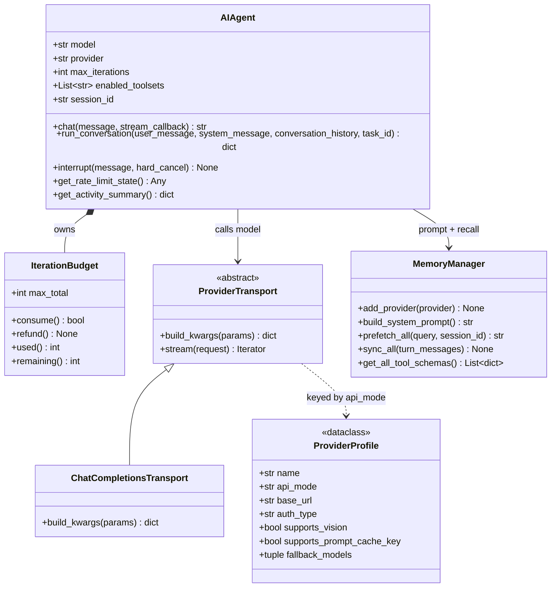
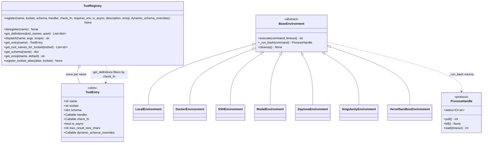
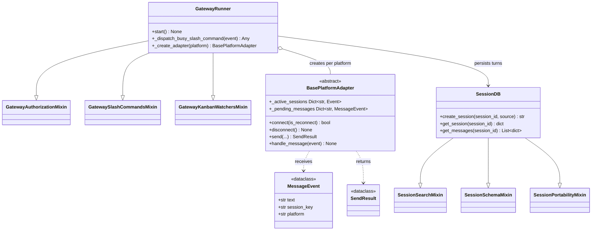
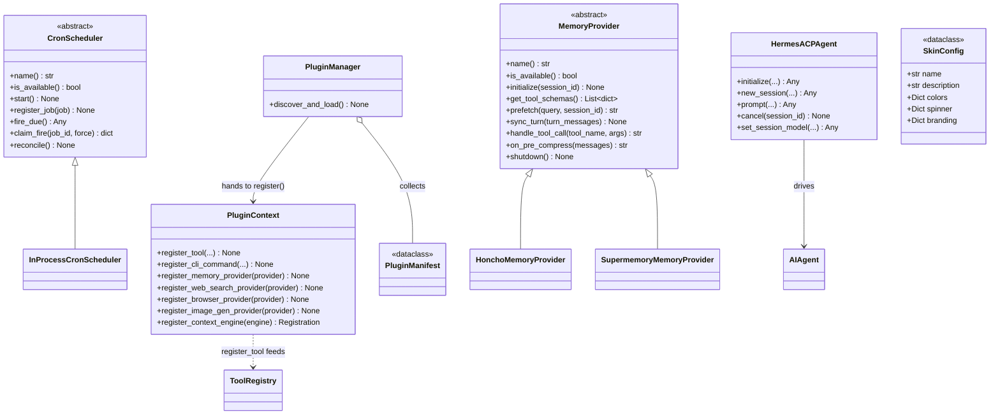

# Class Diagram

The type-level map of Hermes: the engine classes, the tool and environment seams,
the gateway/persistence layer, and the ABCs that define every extension point. Read
it alongside [architecture.md](../architecture.md); member lists are abbreviated to
what a reader needs, and every class and member here was read from source.

Mermaid renders generics as `~T~`. Inheritance is `<|`, composition `*--`,
association `-->`.

## Core Types — Agent Engine

`AIAgent` is the only class every surface constructs. `IterationBudget` is a
property-backed counter (`consume()` / `refund()`), which is how `execute_code`
turns give their iterations back. Note what the transport does *not* own: client
construction, credential refresh, prompt caching, interrupts, and retries all stay
on `AIAgent` — a new per-provider quirk belongs on the `ProviderProfile`, not in a
transport branch.

## Core Types — Tools & Environments

A subclass implements exactly two methods — `_run_bash()` returning a
`ProcessHandle`, and `cleanup()`; the base owns `execute()` with snapshot sourcing,
CWD persistence, interrupt, and timeout. `ToolEntry` uses `__slots__`, so an
attribute typo on a registration raises rather than silently creating a field.

## Core Types — Gateway & Persistence

`BasePlatformAdapter` is an ABC whose abstract contract is `connect()`,
`disconnect()`, and `send()` — that trio is the whole obligation of a new platform.
`SessionDB` is assembled from three mixins living in separate top-level modules
(`hermes_state_search.py`, `hermes_state_schema.py`, `hermes_state_portability.py`),
so search and schema-repair code is not in the 13K-line main file.

## Extension Points (ABCs and registries)

`MemoryProvider` splits its contract deliberately: four `@abstractmethod`s are the
bare identity/availability/tool surface, while the lifecycle hooks
(`prefetch`, `sync_turn`, `on_pre_compress`, `on_delegation`) arrive as overridable
no-ops so a provider implements only what it can actually do. `post_setup` is *not*
on the ABC at all — the setup wizard probes it with `hasattr`, which is why it works
without breaking older providers.

## Notes

What the diagrams cannot express:

- **Import-time registration is the real constructor.** `ToolRegistry` is populated
  by side effect of importing `tools/*.py`, gated by an AST scan for a top-level
  `registry.register()` call. A tool module that never calls it at module level is
  never imported. Likewise `ProviderProfile`s register on load of
  `plugins/model-providers/*`, and `discover_plugins()` runs as a side effect of
  importing `model_tools.py`.
- **`check_fn` results are TTL-cached process-wide** (~30 s, with a last-good grace
  window), keyed partly by profile scope. One process serves many sessions, which is
  exactly why a per-session answer must not be encoded in a `check_fn`.
- **Threading model is mixed.** `AIAgent`'s loop is synchronous; the gateway is
  `asyncio` with per-session `asyncio.Event` objects in `_active_sessions`; the ACP
  adapter is `asyncio` over stdio and must keep stdout reserved for JSON-RPC.
- **Singletons and process globals.** `ToolRegistry` is one instance per process;
  `model_tools._last_resolved_tool_names` is a module global that
  `tools/delegate_tool.py` saves and restores around a subagent run, so readers may
  observe a stale value during a child agent.
- **Profile scoping is layered, not copied.** `ToolRegistry` keeps process-global
  built-ins plus per-scope overlays keyed by `hermes_home_key()`, merged at read
  time; a plugin shadowing a built-in name is rejected unless it passes an explicit
  override policy.
- **`SkinConfig` is pure data.** Adding a theme needs no code — user YAML in
  `~/.hermes/skins/` is checked before built-ins, and missing keys inherit from
  `default`.
