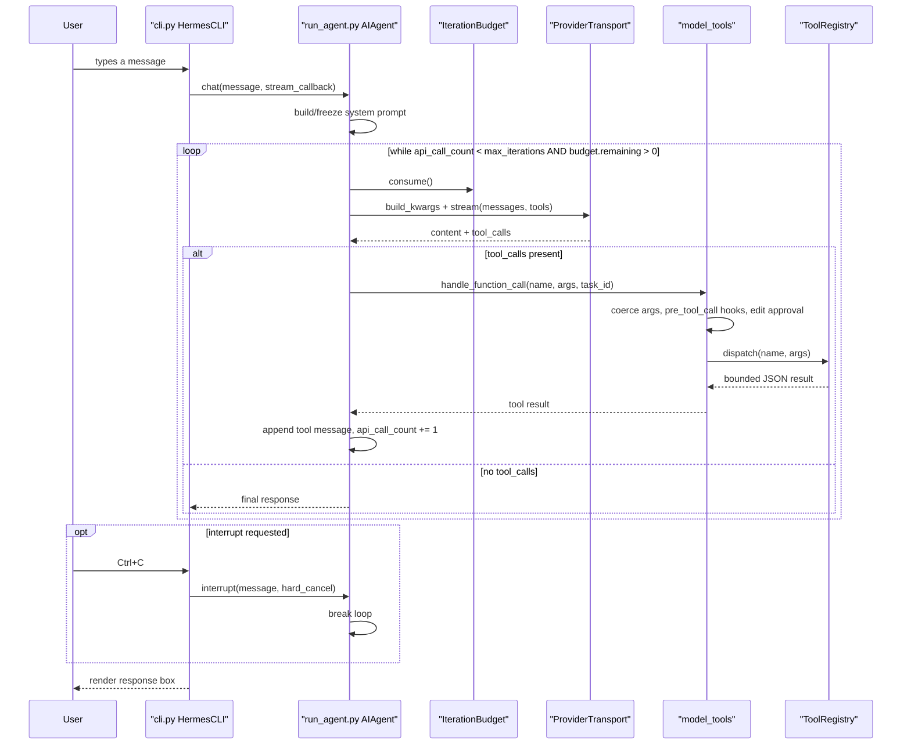
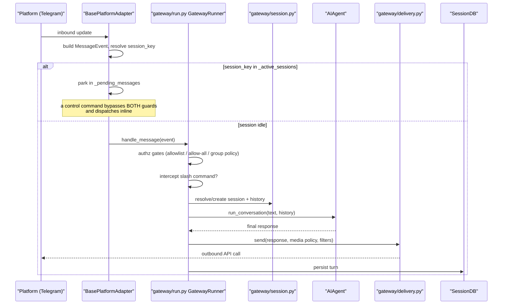
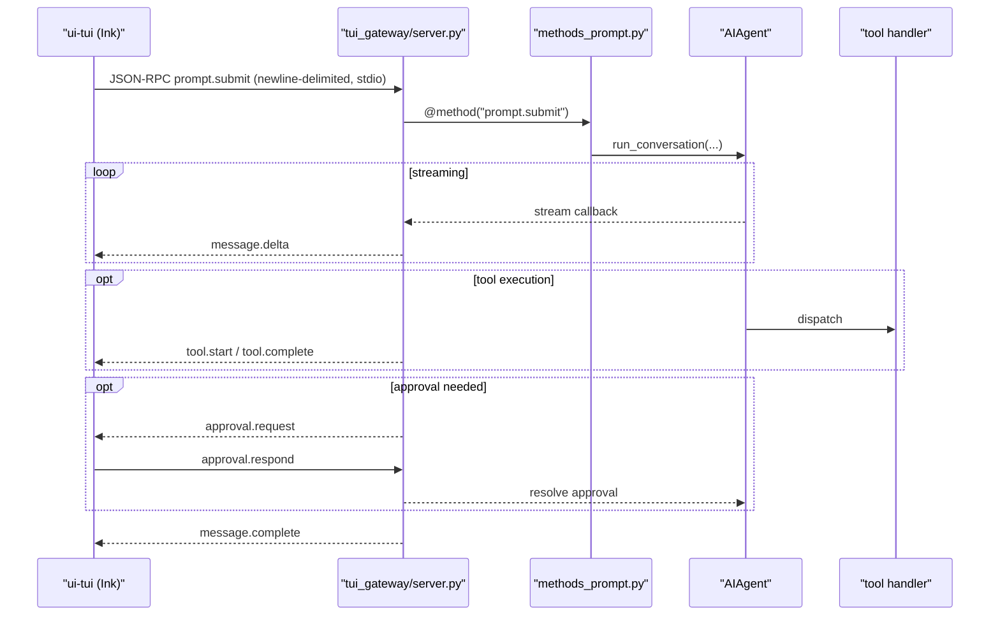
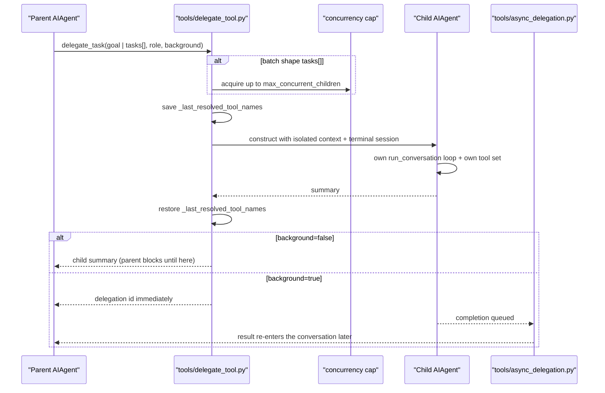

# Sequence Diagrams

Four traced runtime paths through Hermes: an interactive CLI turn, an inbound
gateway message, a TUI turn with its approval round-trip, and subagent delegation.
Every participant is a real component and every arrow is a call located in source;
the walkthrough under each diagram names the file and function where that arrow
lives. Solid `->>` is a call, dashed `-->>` is a return, and `alt`/`loop` blocks
mark real branching in the code.

## Workflow: Interactive CLI Turn

What happens between pressing Enter in `hermes` and seeing an answer, including
the tool-calling loop and the interrupt path.

### Walkthrough

1. **Input** — [`cli.py:HermesCLI.process_command`](../../../cli.py) resolves the
   line through the slash-command registry; a non-command line becomes a prompt.
2. **Dispatch to the engine** — [`run_agent.py:AIAgent.chat`](../../../run_agent.py)
   (`:8808`) wraps [`run_conversation`](../../../run_agent.py) (`:8337`).
3. **Prompt is frozen once** — the system prompt is built and cached for the life of
   the conversation; skills arrive as a *user* message, not a system-prompt edit, so
   the provider-side cache keeps hitting. See
   [`agent/skill_commands.py`](../../../agent/skill_commands.py).
4. **Budget gate** — [`agent/iteration_budget.py:IterationBudget.consume`](../../../agent/iteration_budget.py)
   returns `False` when exhausted; `refund()` gives iterations back for
   `execute_code` turns.
5. **Model call** — [`agent/transports/chat_completions.py:ChatCompletionsTransport`](../../../agent/transports/chat_completions.py)
   builds the request from the session's tool schemas. Tool schemas ride on *every*
   call, which is why the core toolset stays small.
6. **Tool dispatch** — [`model_tools.py:handle_function_call`](../../../model_tools.py)
   (`:1192`) coerces args, runs `pre_tool_call` plugin hooks, and consults
   `maybe_require_edit_approval()` before executing.
7. **Handler execution** — [`tools/registry.py:ToolRegistry.dispatch`](../../../tools/registry.py)
   (`:1102`) bridges `is_async` handlers, normalizes the result, and converts
   exceptions to a bounded `tool_error()`.
8. **Interrupt** — [`run_agent.py:AIAgent.interrupt`](../../../run_agent.py)
   (`:3178`) sets the flag the loop checks each iteration; `hard_cancel` escalates.

## Workflow: Inbound Gateway Message

How a Telegram/Discord/Slack message becomes an agent turn — and why the two
message guards exist in that order.

### Walkthrough

1. **Adapter receives** — [`gateway/platforms/base.py:BasePlatformAdapter`](../../../gateway/platforms/base.py)
   is an ABC whose concrete obligation is `connect()` / `disconnect()` / `send()`;
   the shared inbound path builds a `MessageEvent`.
2. **Guard one — the pending queue** — `_active_sessions` (`:3054`) holds the
   per-session interrupt `Event`; `_pending_messages` (`:3055`) parks a message that
   arrives while that session is mid-turn, so it merges into the running turn rather
   than racing it.
3. **Guard two — runner interception** — [`gateway/run.py`](../../../gateway/run.py)
   intercepts control commands before they reach `running_agent.interrupt()`. The
   bypass set is derived from the command registry's `busy_policy`, not a hardcoded
   list, and the busy path resolves through
   `_dispatch_busy_slash_command` (`:15941`). A command that must reach the runner
   while the agent is blocked must bypass *both* guards and dispatch inline —
   `_process_message_background()` races the session lifecycle.
4. **Authorization** — [`gateway/authz_mixin.py`](../../../gateway/authz_mixin.py)
   applies allowlist / allow-all / group policy. `_platform_gate_env()` is
   fail-closed on a scoped miss; `_auth_env()` is the legacy route that still falls
   through to `os.getenv`.
5. **Session keying** — [`gateway/session.py`](../../../gateway/session.py) maps the
   event to a session identity and loads history.
6. **Delivery** — [`gateway/delivery.py`](../../../gateway/delivery.py) applies media
   policy and response filters before the platform API call.
7. **Persistence** — [`hermes_state.py:SessionDB`](../../../hermes_state.py)
   (`:3093`, assembled from the search/schema/portability mixins) records the turn,
   which is what makes the same conversation resumable from the CLI.

## Workflow: TUI Turn with Approval Round-Trip

The two-process path: Ink renders, Python thinks, JSON-RPC carries both directions.

### Walkthrough

1. **Transport** — newline-delimited JSON-RPC over stdio between the Node process
   and the Python host; see [`tui_gateway/transport.py`](../../../tui_gateway/transport.py)
   and [`tui_gateway/entry.py`](../../../tui_gateway/entry.py).
2. **Method dispatch** — `prompt.submit` is registered by the `@method` decorator at
   [`tui_gateway/methods_prompt.py:268`](../../../tui_gateway/methods_prompt.py).
   The vocabulary is a closed set: `prompt.submit`, `session.*`, `slash.exec`,
   `command.dispatch`, `complete.slash`, `complete.path`, `approval.respond`,
   `clarify.respond`, `config.*`.
3. **Handler pooling matters** — `_LONG_HANDLERS`
   ([`tui_gateway/server.py:194`](../../../tui_gateway/server.py)) decides whether a
   handler runs inline on the socket reader thread. `prompt.submit` resolves without
   waiting so the build happens off-thread; a long handler left out of that set
   stalls every RPC queued behind it on the same socket.
4. **Events out** — `_emit(...)` produces `message.delta`, `message.complete`,
   `tool.start`, `tool.complete`, `approval.request`
   ([`tui_gateway/server.py`](../../../tui_gateway/server.py), `:6109`, `:5844`,
   `:5891`, `:1979`).
5. **Approvals are bidirectional** — the agent asks with `approval.request` and the
   client answers `approval.respond`; the same shape serves `clarify`, `sudo`, and
   `secret`.
6. **Slash commands** — client-side built-ins are handled locally in
   [`ui-tui/src/app.tsx`](../../../ui-tui/src/app.tsx); everything else goes to
   `slash.exec` on a persistent `_SlashWorker`
   ([`tui_gateway/slash_worker.py`](../../../tui_gateway/slash_worker.py)) with a
   `command.dispatch` fallback.

## Workflow: Subagent Delegation

How `delegate_task` spawns an isolated child agent, and how the background variant
re-enters the parent conversation later.

### Walkthrough

1. **Tool entry** — `delegate_task` is registered at
   [`tools/delegate_tool.py:4774`](../../../tools/delegate_tool.py); its schema
   carries `dynamic_schema_overrides` so the model is told the user's *current*
   `delegation.max_concurrent_children` / `max_spawn_depth` rather than the values
   frozen at import time.
2. **Child construction** — [`tools/delegate_tool.py:_run_single_child`](../../../tools/delegate_tool.py)
   (`:2314`) builds an isolated `AIAgent` and its own terminal session, and saves /
   restores the `model_tools._last_resolved_tool_names` process-global around the
   run — without that, a child's tool resolution would corrupt the parent's.
3. **Role gating** — `role="leaf"` is the default (`_normalize_role()` coerces an
   unknown string to it, `:731`) and the deny set is `DELEGATE_BLOCKED_TOOLS`
   (`tools/delegate_tool.py:50-58`): `delegate_task`, `clarify`, `memory`,
   `send_message`, `cronjob`. Two layers subtract it and they are not equivalent.
   `_blocked_toolsets_for_role()` (`:1187`) yields the one-tool deny toolsets;
   `_build_child_agent` appends them to the child's `disabled_toolsets` (`:1579`) and
   passes that to `AIAgent` (`:1839`), so `model_tools` subtracts the blocked names
   *after* composite expansion and the ban survives a later registry/MCP refresh.
   `_strip_blocked_tools()` (`:1166`) drops whole toolsets, plus `kanban`
   unconditionally (`:1183`) for either role. **`send_message` is enforced by neither
   layer** — it is never registered as an agent-callable tool
   (`tools/send_message_tool.py:2264`: "intentionally NOT registered as an
   agent-callable model tool"), so it is absent by construction rather than subtracted;
   its send engine stays importable for cron delivery, `hermes send`, the kanban
   notifier and `mcp_serve.py`. Two traps in the strip layer: it reads the *static*
   `TOOLSETS` dict (`:1179`), so `all(t in DELEGATE_BLOCKED_TOOLS for t in
   defn.get("tools", []))` (`:1181`) is vacuously true whenever a toolset's static
   `tools` list is empty — measured, it drops eight toolsets rather than five, with
   `safe`, `context_engine` and `hermes-gateway` going as collateral even though
   `hermes-gateway` resolves to 72 tools at runtime. And its docstring
   (`:1169-1172`) still lists `code_execution` among the composite blocks while `:1176`
   holds only `delegation`; the code is the contract, and that gap is what keeps
   `execute_code` reachable — pinned by `tests/tools/test_delegate.py:201` and `:773`,
   with `:211` asserting the leaf schema is disjoint from all five names.
   `role="orchestrator"` re-admits `delegate_task` (`:1198-1199`) and is bounded by
   `delegation.max_spawn_depth`.
4. **Concurrency** — batch fan-out is capped by
   `delegation.max_concurrent_children`; depth by `delegation.max_spawn_depth`.
5. **Async return** — with `background=true` the parent gets an id and continues;
   [`tools/async_delegation.py`](../../../tools/async_delegation.py) holds the
   completion queue that re-enters the conversation on a later turn.
6. **Durability boundary** — background delegation is detached from the turn but
   still process-local. Work that must survive a restart belongs in `cronjob` or
   `terminal(background=True, notify_on_complete=True)`.

See [modules/delegation-kanban.md](../modules/delegation-kanban.md) for the durable
alternative, and [class-diagram.md](class-diagram.md) for the
types these flows move through.
