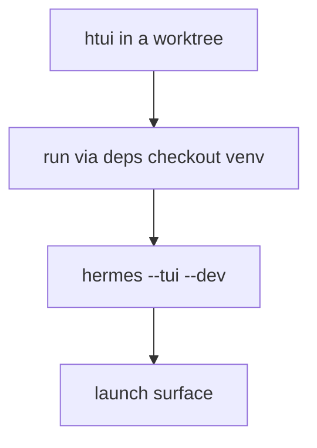

# TUI from Worktrees

The Python core runs fine from any [git worktree](../user-guide/git-worktrees.md) — `cd` in and `hermes` just works. The one TypeScript surface does not: `ui-tui/` needs a populated `node_modules`, and a fresh `npm ci` per worktree is slow and duplicates gigabytes across every branch you have checked out.

`htui` is a shell helper that closes that gap. It launches the TUI **from the current worktree** using the canonical checkout's venv — so a throwaway branch costs a launch, not an install.

It's a developer convenience, not a shipped command. Drop it in `~/.zshrc`; adapt paths to taste.

## The deps model

One checkout is the **deps checkout** — the one place you actually run `npm install`. Every other worktree runs against it through that checkout's `.venv/bin/python`, and only installs locally when a dependency diverges (a branch that bumps a dependency must not silently run against stale packages).



One env var names the canonical checkout:

| Variable | Meaning |
|----------|---------|
| `HERMES_MAIN_CHECKOUT` | The deps checkout — where `node_modules` really lives, and whose `.venv/bin/python` runs the backend. |

It's not read by Hermes itself — it's private to this helper. The variables Hermes *does* read are covered in [Environment Variables](../reference/environment-variables.md).

## `htui` — TUI from the worktree

The Ink TUI has a dev path already: `hermes --tui --dev` runs the TypeScript sources via `tsx` instead of the prebuilt bundle. `htui` is a one-liner over it that also points the run at the current worktree's `ui-tui/`:

```bash
htui() {
  local root
  root="$(_hermes_root)" || { echo "htui: not in a Hermes checkout" >&2; return 1; }
  ( cd "$root" && PYTHONPATH="$root" \
      "$HERMES_MAIN_CHECKOUT/.venv/bin/python" -m hermes_cli.main --tui --dev "$@" )
}
```

`--dev` compiles from source, so Hermes installs TUI dependencies into `ui-tui/` on first run when they're missing (see [`_hermes_root`](#shared-helpers)).

:::warning `--dev` and `HERMES_TUI_DIR` are mutually exclusive
`HERMES_TUI_DIR` points Hermes at a *prebuilt* bundle (Nix, system packages), which has no source to hot-reload. If it's set in your shell, `hermes --tui --dev` exits with an error. Run `unset HERMES_TUI_DIR` before `htui`.
:::

## Shared helpers

```bash
# The enclosing worktree, verified as a real Hermes checkout.
_hermes_root() {
  local root
  root="$(git rev-parse --show-toplevel 2>/dev/null)" || return 1
  [[ -f "$root/hermes_cli/main.py" && -d "$root/ui-tui" ]] && print -r "$root"
}
```

:::info Why a verified root
`git rev-parse --show-toplevel` alone can report a sub-worktree that isn't a full Hermes checkout (e.g. a docs-only worktree). Checking for `hermes_cli/main.py` and `ui-tui/` keeps the helper from launching against a partial tree.
:::

## See also

- [Git Worktrees](../user-guide/git-worktrees.md) — the isolation model this helper builds on
- [TUI](../user-guide/tui.md) — `hermes --tui --dev` and the `HERMES_TUI_DIR` prebuild path
- [Environment Variables](../reference/environment-variables.md) — every `HERMES_*` variable Hermes reads
